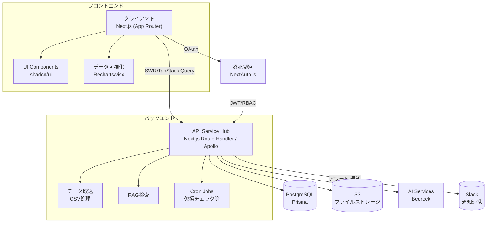
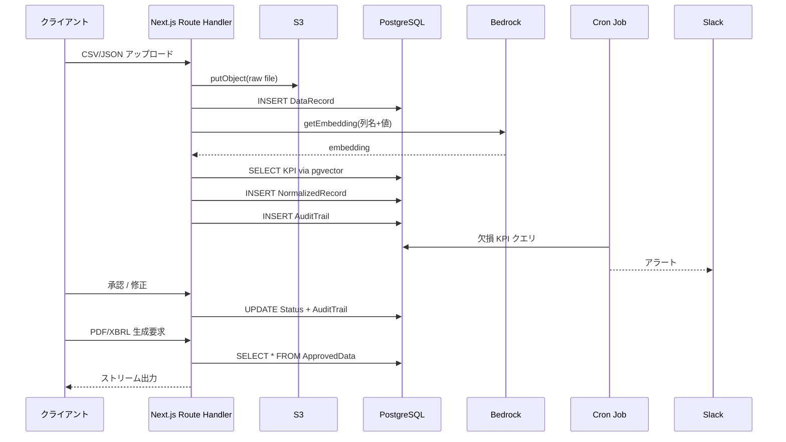

[現状定義書](https://www.notion.so/2044e463cff780519d0ed293abca5f7c?pvs=21)

# Project Context Sheet

| # | カテゴリ | 最新入力内容 |
| --- | --- | --- |
| **①** | プロジェクト正式名称 | **ESG Data Hub** |
| **②** | 開発の背景・起点 | ISSB 国内ガイドライン（2025/3）→ 2027年義務化。成長期だが未成熟で参入余地。AI が得意な領域。 |
| **③** | 最上位目的（KGI） | ESG 関連資料作成工数 **50 %以上削減** |
| **④** | サブ目標（KPI） | ・データ収集工数 **80 %減**・監査指摘率 **50 %減** |
| **⑤** | 想定ユーザ／ペルソナ | IR部・経営企画部・監査室（20–30 名） |
| **⑥** | 利害関係者 | 監査法人、株主 |
| **⑦** | 解決すべき業務課題 | データ散在、単位バラつき、複数フォーマット突合、欠損KPI、トレーサビリティ不足、履歴煩雑、社外連携難度 |
| **⑧** | 競合・代替策 | 調査中 |
| **⑨** | スコープ範囲 | コミット：ESG情報収集〜監査／証跡ストレッチ：資料作成 |
| **⑩** | 非機能要求 Top 3 | ・月間稼働率 ≥ **99.9 %**（≒月43 分ダウンまで）・**ISO 27001 & SOC 2 Type II** 準拠・KPI 自動マッピング **≤ 500 ms／列** |
| **⑪** | 依存・前提条件 | ・導入企業が定常データ源を把握済み・監査法人が Web ベース閲覧を許容 |
| **⑫** | 主要機能リスト | データ統合ハブ、AIマッピング、マルチレギュレーション対応、KPIチェッカー、証跡WF、バージョンチェーン、API&ダッシュボード |
| **⑬** | 既存システム／資産 | なし |
| **⑭** | 成功判定基準 | ・工数 50 % 以上削減・プライム企業 33 %以上へ導入 |
| **⑮** | 技術／インフラ制約 | Next.js + Vercel（無料枠中心）、生成AI組込 |
| **⑯** | 予算・コスト上限 | 無料枠中心（初期費用極小） |
| **⑰** | タイムライン | **3 週間以内に MVP** |
| **⑱** | 法規・規制対応 | 初期フェーズは深掘りせず |
| **⑲** | リスク & 回避策 | ・**MVP が完了しない**／影響大 → 週2回以上の進捗レビュー・**部門データに欠損**／影響小 → 管理画面警告＋代替入力フォーム |
| **⑳** | 用語集／略語 | ―（任意） |

# BR（Business Requirements）ドラフト

### 1. ビジネス背景 & 問題提起

| 観点 | 内容 |
| --- | --- |
| 市場動向 | 2025 年 3 月に **ISSB 国内ガイドライン** 制定。2027 年度からプライム市場企業は同基準に沿った IR 報告書作成が義務化。ESG 報告ソフト市場は成長期だが、環境特化や Excel 延命型ツールが主流で、**統合データ基盤＋多基準自動マッピング**の領域は空白。 |
| 業務課題 | - データ散在・縦割りで収集工数が膨大- 項目名／単位の統一に手作業が残る- 多重提出フォーマット突合が煩雑- 欠損 KPI 見落としが監査指摘につながる- 証跡・バージョン管理が不足し監査に不安 |
| 機会 | AI／LLM による **自動マッピング・欠損検知・フォーマット変換** が有効。競合は環境特化または人手ワークフローが主体で、**横断 ESG＋リアルタイム連携** は差別化ポイント。 |

---

### 2. ビジネスゴール体系

| レベル | 指標 | 目標値 | 備考 |
| --- | --- | --- | --- |
| **KGI** | ESG 関連資料作成総工数 | **-50 % 以上** | 有価証券報告書／統合報告書対象 |
| KPI‑1 | データ収集工数 | **-80 %** | 部門・子会社からのデータ取得 |
| KPI‑2 | 監査指摘率 | **-50 %** | 指摘／全レビュー項目 |

---

### 3. ステークホルダ & ペルソナ

| 役割 | 目的／関心 | 主な利用機能 |
| --- | --- | --- |
| IR部門（主ペルソナ） | 期日内に正確な IR/統合報告書を提出 | データ統合ハブ、マッピング、KPI チェッカー |
| 経営企画 | 統合 KPI を経営判断に活用 | ダッシュボード、差分ビューア |
| 監査室 | 証跡確認・内部統制 | 証跡ワークフロー、バージョンチェーン |
| 監査法人 | レビュー効率化 | Web 閲覧、API 連携 |
| 株主／投資家 | 情報開示の透明性 | （公開先）IR サイト出力 |

---

### 4. To‑Be 業務フロー（ハイレベル）

1. **データ取込** — CSV/ERP/BI/API からバッチ or Webhook で自動集約
2. **意味マッピング** — LLM＋辞書で列⇔KPI を解析し自動ラベリング（≤500 ms/列）
3. **単位統一** — 確定した KPI に応じ kg⇔t などを自動換算
4. **KPI コンプライアンスチェック** — ISSB／CSRD の必須リストと突合→欠損アラート
5. **証跡付ワークフロー承認** — 多段階レビュー & 変更履歴をチェーン保持
6. **監査 & 分析** — 監査法人は Web 上で差分・出典 URI を確認
7. **マルチフォーマット出力（ストレッチ）** — ISSB/ESRS/XBRL/PDF をワンクリック生成

> 現行 (As‑Is) は Excel／メール中心で 1–4 週間/サイクル。To‑Be は 日次自動更新＋1 日承認 を想定。
> 

---

### 5. ビジネス要求一覧（MoSCoW）

| 優先 | 要求 ID | ビジネス要求 (WHAT) | 背景 (WHY) |
| --- | --- | --- | --- |
| **Must** | BR‑01 | 部門・子会社からの ESG データ自動集約 | 収集工数 80 % 削減 |
| Must | BR‑02 | 列名＋サンプル値から KPI を自動ラベリング（意味マッピング） | 単位統一／誤入力防止 |
| Must | BR‑03 | 自動単位換算で共通スケール化（単位統一） | 単位統一／データ品質向上 |
| Must | BR‑04 | 欠損 KPI アラートと担当部門レポート | 監査指摘率 50 % 削減 |
| Must | BR‑05 | 変更履歴・証跡をブロックチェーン型で保持 | 内部統制 & 監査対応 |
| **Should** | BR‑06 | ベンチマーク分析（同業他社比較） | 開示内容最適化 |
| Should | BR‑07 | XBRL オンデマンド生成 | 金商法電子提出効率化 |
| **Could** | BR‑08 | ISSB・CSRD など多基準テンプレ出力 | 多重提出工数削減 |
| Could | BR‑09 | Web ベース監査閲覧（閲覧専用権限） | 監査法人要件 |
| **Won’t (v1)** | BR‑10 | AI による英文翻訳 & 生成 | 後続フェーズで検討 |

---

### 6. 非機能ビジネス要求（抜粋）

| カテゴリ | 指標／目標 |
| --- | --- |
| 可用性 | 月間稼働率 ≥ **99.9 %** |
| 性能 | 意味マッピング ≤ **500 ms/列**, ダッシュボード初回表示 ≤ 2 sec |
| セキュリティ | **ISO 27001, SOC 2 Type II** 準拠, データ暗号化 (AES‑256 at rest) |
| 法規制 | ISSB, CSRD, 電帳法（日本）を追従可能なモジュール設計 |
| UX | 初回オンボーディング ≤ 1 時間, NPS +30 pt |

---

### 7. 事前前提 & 制約

| 区分 | 内容 |
| --- | --- |
| 技術 | Next.js + Vercel 無料枠, Bedrock/OpenAI API 無料ティアで PoC |
| データ | **導入企業がデータ源を把握済み**／CSV or API 提供可能 |
| 組織 | 監査法人が Web 閲覧を許容すること |
| 時間 | **3 週間で MVP**（BR‑01〜05 を中心に実装） |

---

### 8. ビジネスリスク & 対策

| リスク ID | 事象 | 影響 | 確率 | 対策 |
| --- | --- | --- | --- | --- |
| R‑01 | MVP 期限内に BR‑05 (証跡) 実装が難航 | 工数増・監査適合性低下 | 中 | 週 2 回レビュー＋範囲再交渉 |
| R‑02 | 部門データ欠損／遅延 | KPI 欠落→監査指摘 | 中 | 警告アラート＋代替入力フォーム |
| R‑03 | LLM API コストが無料枠超過 | 追加費用 | 低 | 推論回数制限・ローカル推論検討 |

# 2. SR（System Requirements）ドラフト

> 目的: BR の Must 要求 (BR‑01〜04) を MVP スコープとして実装できるよう、システム視点の "WHAT / HOW" を定義する。
> 

### 2.1 機能要求一覧 (Functional Requirements)

| ID | 機能 (WHAT) | 主な処理 (HOW) | 関連 BR |
| --- | --- | --- | --- |
| **FR‑01** | データ取込インタフェース | • CSV/Excel アップロード• REST API/Webhook (JSON)• スケジューラ取込 | BR‑01 |
| **FR‑02a** | **意味マッピングエンジン** | 列名+サンプル値→ `kpi_id` 付与 (LLM + 辞書) | BR‑02‑a |
| **FR‑02b** | **単位統一エンジン** | `kpi_id` に基づき自動換算 (kg⇄t 等) | BR‑02‑b |
| **FR‑03** | KPI コンプライアンスチェック | 未入力 / 欠損 KPI を検出しアラート発報 | BR‑03 |
| **FR‑04** | 証跡 & バージョンチェーン | CRUD すべてをブロックチェーン型ストアへ記録 | BR‑04 |
| **FR‑05** | 多基準テンプレ出力 (ISSB 他) | JSON→CSV/PDF/XBRL 変換 (テンプレベース) | BR‑05 |
| **FR‑06** | 監査閲覧ポータル | 読取専用 UI + 監査コメント機能 | BR‑06 |
| **FR‑07** | ベンチマーク分析 | 同業他社公開データとの統合グラフ | BR‑07 |
| **FR‑08** | XBRL オンデマンド生成 | e‑Gov 仕様に準拠 | BR‑08 |

*★MVP = FR‑01〜04 (太字)*

### 2.2 情報モデル (High‑Level ER)

| テーブル | ざっくり役割 | キーワード |
| --- | --- | --- |
| DataSource | データがやって来る元を管理します。CSV を投げてくる環境部、SAP から届く API、仕入先ポータル…そうした 送り主 をひとつずつ登録します。 | “どこから” |
| DataRecord | DataSource から届いた データの行そのもの。値(123)、単位(kg)、いつ届いたか、などを素のまま保管。 | “何が来た” |
| KPI | “CO₂ 排出量（トン/月）” など 公式に定義された 1 項目 を表します。ここで単位も決め打ち。 | “何を測る” |
| MappingRule | CSV 列名や値の中身を見て「この行は CO₂ 排出量だね」と自動で紐づけるための 変換ルール集。LLM が新しいあだ名を学んだらここに追記。 | “呼び名の訳” |
| AuditTrail | レコードがいつ・誰に・どう直されたかを鎖のように連続記録。改ざん防止シールだと思ってください。 | “いじった履歴” |
| WorkflowTask | データ行が“承認フロー”を進むときの通過点。誰が OK して、どこで止まっているかを管理。 | “承認の通過点” |

### 2.3各機能ごとの技術選定

| ブロック | 主要ライブラリ & サービス | 補足（なぜ選ぶ？／主な代替） |
| --- | --- | --- |
| **1. データインジェスト** | • **Next.js Route Handler** (Edge≒Lambda @Edge)
• **Busboy** or **Formidable** – multipart 解析
• **AWS SDK v3** – S3 putObject• **Zod** – CSV 行バリデーション
• **Prisma `createMany`** – Postgres Bulk | Vercel + S3 は無料枠あり／Busboy は軽量。代替: `node-fetch-blob` + `multer` |
| **2. スキーママッピング & 正規化** | • **pgvector** 拡張（Postgres）
• **aws-bedrock Titane-E** (128-d Embedding) ※1
• **@aws-sdk/bedrock-runtime**
• **yaml** npm pkg – KPI 辞書ロード | Bedrock は試用クレジット有、個人検証なら OpenAI embeddings でも可 |
| **3. メタデータ／監査証跡** | • **Prisma** モデル (`Data`, `DataVersion`, etc.)
• **bcrypt** – checksum 生成
• **Next.js Middleware** – user/IP injection | 将来ブロックチェーン連携する場合は Fabric or Ledger DB に拡張 |
| **4. ベクトル検索 & ガイドラインリンク** | • **pgvector** `ivfflat` index
• **Prisma Raw SQL** (`ORDER BY embedding <-> $query`)
• **Markdown-it** (条文レンダリング) | 代替: **Pinecone** / **Chroma** 専用 DB（無料 tier 1 GB） |
| **5. KPI 欠損アラート** | • **Vercel Cron** – 日次 Job
• **Prisma `NOT EXISTS`** クエリ
• **@slack/webhook** – Slack 通知 | GitHub Actions でも代用可（無料） |
| **6. データカタログ & API** | • **Next.js Route Handler** – REST
• **Apollo Server @ Edge** – GraphQL
• **Kysely QueryBuilder** or Prisma “row-level security” patch | Supabase PostgREST を使う手もあるが、Vercel + Next.js 単体で完結させやすい |
| **7. 権限制御** | • **NextAuth.js** – OAuth/JWT
• **jsonwebtoken** – role claim 署名
• **Next.js Middleware** – RBAC Gate | 企業 SSO 対応は Auth0/Clerk/Pomerium に置換可 |
| **8. ダッシュボード** | • **TanStack Query** + **SWR** – データフェッチ
• **Recharts** or **@visx/xychart** – グラフ
• **shadcn/ui Card** – KPI コンポーネント | どれも MIT ライセンス／ツリーシェイク済で Vercel 向き |

```jsx
my-regtech-app/
├─ apps/                         ← “実行体”を置くレイヤ
│  ├─ web/                       ← Next.js（App Router）フロント
│  │  ├─ app/                   ┃  ルート・ページ・レイアウト
│  │  ├─ components/            ┃  再利用 UI（shadcn/ui 派生）
│  │  ├─ lib/                   ┃  クライアント-サイド util（SWR ラッパなど）
│  │  ├─ styles/                ┃  Tailwind / global.css
│  │  └─ next.config.mjs
│  └─ api/                       ← バックエンド機能をまとめる“サービスハブ”
│     ├─ ingest/                 ┃  CSV 取込エンドポイント
│     │  └─ route.ts
│     ├─ rag/                    ┃  埋め込み生成＋近傍検索（後段）
│     ├─ jobs/                   ┃  Vercel Cron 関数（欠損チェック等）
│     ├─ graphql/                ┃  Apollo Edge Server
│     └─ middleware.ts           ┃  共通 RBAC／ロギング
├─ packages/                     ← “共有コード”を置くレイヤ
│  ├─ types/                     ┃  Zod スキーマ・DTO 型定義
│  │  └─ kpi.ts
│  ├─ utils/                     ┃  S3 / Bedrock / Slack helper
│  ├─ ui/                        ┃  shadcn 拡張・Storybook
│  └─ env/                       ┃  @typescript-dotenv 型付き env
├─ prisma/                       ← DB スキーマ&マイグレーション
│  ├─ schema.prisma
│  └─ migrations/
├─ .github/
│  └─ workflows/ci.yml          ← lint・test・build を実行
├─ docker/                       ← dev 用 compose, Dockerfile
├─ .eslintrc.cjs  /  .prettierrc /  tsconfig.json
├─ .env.example                  ← 必須環境変数の雛形
├─ package.json                  ← npm workspaces 設定
└─ README.md                     ← セットアップ＆コントリビュートガイド
```

| 場所 | 中に置くコード・ファイル | 置かないもの | 主な `import` 元 |
| --- | --- | --- | --- |
| **`apps/web`** | - **ページ‐レベルの UI** (`app/page.tsx`, `layout.tsx`)
- 各画面でしか使わないローカル状態・hooks
- 画面遷移（リンク、モーダル）
- *外部 API 呼び出しは SWR などで fetch* | - DB 直接アクセス
- 大規模ビジネスロジック- 外部 SDK 鍵 | `packages/ui`, `packages/types`, `packages/utils` |
| **`apps/api`** | - **バックエンドのエンドポイント**　`/ingest/route.ts`, `/graphql/handler.ts`
- Cron 関数 (`jobs/`)
- API 専用の services（S3 ↔ DB）
- Next.js `Middleware` で認可チェック | - React コンポーネント
- 画面レイアウト | `packages/utils`, `packages/types`, `prisma` |
| **`packages`***(共通ライブラリ集)* | - **`types/`**：DTO / Zod スキーマ “型の源”
- **`utils/`**：S3, Bedrock, Slack など汎用 helper
- **`ui/`**：shadcn / Tailwind ベース再利用 UI
- **`env/`**：型付き環境変数ローダ | - ページ固有ロジック
- 環境に依存する設定値 (URL は env に) | 内部で依存し合う or 外部 SDK |
| **`prisma`** | - **`schema.prisma`**：ER 図の真実
- `migrations/`：DDL 差分
- `seed.ts`：初期データ投入 | - ビジネスロジック | n/a（Prisma CLI が読む） |
| **`docker/`** *(任意)* | - `docker-compose.yml`：ローカル Postgres / MinIO など
- `Dockerfile.dev`：CI で同じ環境を再現 | - プロダクション用 Docker（Vercel がビルド） | — |

### 2.4 トレーサビリティマトリクス (抜粋)

| BR → FR | 対応状況 |
| --- | --- |
| BR‑01 | FR‑01 ✔︎ |
| BR‑02‑a | FR‑02a ✔︎ |
| BR‑02‑b | FR‑02b ✔︎ |
| BR‑03 | FR‑03 ✔︎ |
| BR‑04 | FR‑04 ✔︎ |

### 2.5 MVP スコープ詳細

- **Phase‑1 (Week 1)**: FR‑01, 02a プロトタイプ
- **Phase‑2 (Week 2)**: FR‑02b, 03 ＋ UI α
- **Phase‑3 (Week 3)**: FR‑04 + Hardening / Demo

## 全体フロー



## 技術フロー

