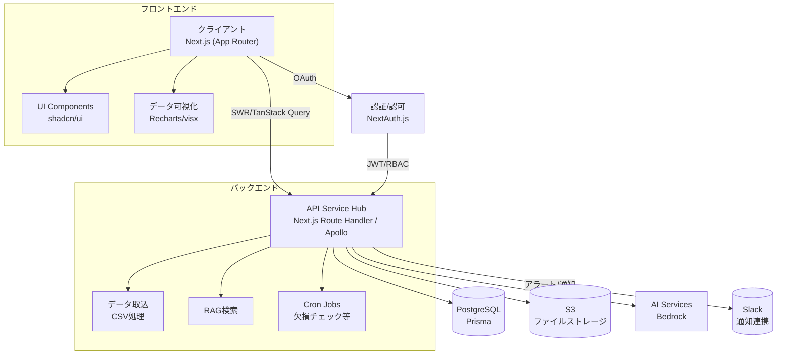

```mermaid
flowchart TB
    %% Main Components
    Client["クライアント\nNext.js (App Router)"]
    API["API Service Hub\nNext.js Route Handler / Apollo"]
    DB[(PostgreSQL\nPrisma)]
    S3[(S3\nファイルストレージ)]
    AI["AI Services\nBedrock"]
    Auth["認証/認可\nNextAuth.js"]

    %% Data Flow
    Client -->|"SWR/TanStack Query"| API
    API --> DB
    API --> S3
    API --> AI
    
    %% Auth Flow
    Auth -->|"JWT/RBAC"| API
    Client -->|"OAuth"| Auth

    %% Subcomponents
    subgraph Frontend ["フロントエンド"]
        direction TB
        UI["UI Components\nshadcn/ui"]
        Charts["データ可視化\nRecharts/visx"]
        Client --> UI
        Client --> Charts
    end

    subgraph Backend ["バックエンド"]
        direction TB
        Ingest["データ取込\nCSV処理"]
        RAG["RAG検索"]
        Jobs["Cron Jobs\n欠損チェック等"]
        API --> Ingest
        API --> RAG
        API --> Jobs
    end

    %% External Systems
    Slack[("Slack\n通知連携")]
    API -->|"アラート/通知"| Slack

    %% 説明コメント
    %% ESG Data Hub システム構成図
    %% データフローと主要コンポーネントの関係を表現
```